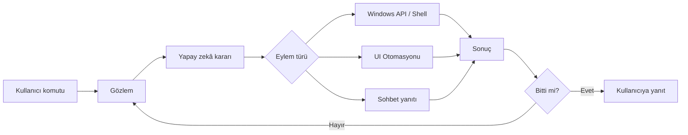

# Windows AI Assistant

Windows masaüstünüzde **sesli veya yazılı komutlarla** işlem yapan yapay zekâ asistanı. «Not defterini aç», «Wi-Fi durumunu söyle», «Chrome’da YouTube’u aç» veya «bu klasördeki PDF dosyalarını listele» gibi istekleri doğal Türkçe ile iletebilirsiniz; asistan hedefi anlar, adımları planlar ve bilgisayarınızda uygular.

[](CHANGELOG.md)
[](https://github.com/rftsngl/BitirmeGelistirme)
[](https://dotnet.microsoft.com/download/dotnet/8.0)
[](#)

> **Sürüm:** 1.1.0 · **Platform:** Windows 10 (2004+) / Windows 11 · **Mimari:** x64  
> **Depo:** [github.com/rftsngl/BitirmeGelistirme](https://github.com/rftsngl/BitirmeGelistirme)

---

## İçindekiler

- [Ne yapar?](#ne-yapar)
- [Nasıl çalışır?](#nasıl-çalışır)
- [Gereksinimler](#gereksinimler)
- [Kurulum](#kurulum)
- [İlk yapılandırma](#ilk-yapılandırma)
- [Kullanım kılavuzu](#kullanım-kılavuzu)
- [Yapabilecekleri](#yapabilecekleri)
- [Ayarlar](#ayarlar)
- [Güvenlik ve onaylar](#güvenlik-ve-onaylar)
- [Gizlilik ve veri](#gizlilik-ve-veri)
- [Sorun giderme](#sorun-giderme)
- [Sürümler ve indirme](#sürümler-ve-indirme)
- [Kaldırma](#kaldırma)
- [Geliştiriciler için](#geliştiriciler-için)

---

## Ne yapar?

| Özellik | Açıklama |
|---------|----------|
| **Sesli komut** | «Asistan» uyandırma kelimesi veya `Ctrl+Alt+A` kısayolu ile her yerden konuşarak komut verin |
| **Yazılı komut** | Ana penceredeki sohbet ekranından yazarak aynı yeteneklere erişin |
| **Otonom masaüstü işlemleri** | Uygulama açma, dosya arama, ağ/ses bilgisi, terminal komutları, pencere yönetimi ve daha fazlası |
| **Çok adımlı görevler** | Tek komutta birden fazla adım planlar; örneğin uygulama açıp içinde işlem yapabilir |
| **Sesli yanıt** | Sonuçları Türkçe seslendirir (Edge TTS veya Windows yerel sesi) |
| **Onay mekanizması** | Silme, shell komutu veya hassas işlemlerde sizden izin ister |
| **Geçmiş kaydı** | Her çalışmanın komutunu, adımlarını ve sonucunu inceleyebilirsiniz |
| **Arka plan çalışma** | Sistem tepsisinde kalır; pencereyi kapatınca dinlemeye devam edebilir |

---

## Nasıl çalışır?

Asistan basit bir «sohbet botu» değil; **gözlem → karar → eylem** döngüsüyle masaüstünüzü yöneten bir operatördür.



**Gözlem:** Her adımda odaktaki pencere, görünür pencere listesi ve (gerekirse) UI Automation (UIA) ağacı toplanır. Vision açıksa ekran görüntüsü de modele gönderilebilir.

**Karar:** Seçtiğiniz yapay zekâ modeli (OpenAI, Gemini, Ollama vb.) bir sonraki eylemi JSON formatında üretir. Model, mümkün olduğunca **doğrudan Windows API'lerini** tercih eder; örneğin ses seviyesi için arayüzde tıklamak yerine `audio_power` eylemini kullanır.

**Eylem:** Runtime katmanı eylemi çalıştırır. Risk seviyesine göre otomatik onaylanır veya sizden izin istenir.

**Döngü:** Görev tamamlanana kadar (en fazla 10 adım) bu süreç tekrarlanır. Planlama ve doğrulama aşamaları açıksa model önce plan yapar, bitince sonucu kontrol eder.

> **Not:** Asistan kendi penceresine ve sesli overlay paneline otomasyon uygulayamaz; bu kasıtlı bir güvenlik sınırıdır.

---

## Gereksinimler

| Bileşen | Gereksinim |
|---------|------------|
| **İşletim sistemi** | Windows 10 sürüm 2004 (build 19041) veya üzeri, Windows 11 |
| **İşlemci mimarisi** | x64 |
| **İnternet** | Bulut yapay zekâ sağlayıcısı ve Edge TTS için gerekli; komut dinleme yerel çalışır |
| **Yapay zekâ hesabı** | OpenAI API anahtarı, Google Gemini anahtarı **veya** yerel sunucu (Ollama / LM Studio) |
| **Mikrofon** | Sesli kullanım için (kulaklık veya harici mikrofon önerilir) |
| **Disk alanı** | Uygulama + isteğe bağlı Whisper/Vosk ses modelleri (~150 MB – 1,5 GB) |

---

## Kurulum

1. `WindowsAiAssistant-Setup-1.1.0.exe` kurulum dosyasını çalıştırın.
2. Sihirbazı tamamlayın. İsteğe bağlı olarak:
   - Masaüstü kısayolu oluşturabilirsiniz
   - Windows açılışında arka planda başlatmayı seçebilirsiniz
3. İlk açılışta **mikrofon izni** istenirse **İzin ver** deyin.

Kurulumdan sonra uygulama **sistem tepsisinde** (saat yanı) çalışabilir. Ana pencereyi kapatmak uygulamayı sonlandırmaz; tepsi simgesinden erişmeye devam edersiniz.

---

## İlk yapılandırma

### 1. Yapay zekâ bağlantısı

**Ayarlar → Yapay zeka modeli** bölümünden bir profil seçin veya oluşturun:

| Sağlayıcı | Ne gerekir? | Örnek model |
|-----------|-------------|-------------|
| **OpenAI** | [platform.openai.com](https://platform.openai.com) API anahtarı | `gpt-4o-mini` |
| **Google Gemini** | Google AI Studio API anahtarı | `gemini-2.0-flash` |
| **Ollama** (yerel) | Bilgisayarınızda çalışan Ollama sunucusu (`http://localhost:11434`) | `llama3`, `qwen2.5` |
| **LM Studio** (yerel) | LM Studio yerel sunucusu (`http://localhost:1234`) | Yüklü modeliniz |

Anahtarı ilgili alana yapıştırın ve **Bağlantıyı test et** ile doğrulayın. Asistan sayfasındaki durum göstergesi yeşile döndüğünde hazırsınız.

**Vision desteği:** Profilde açıksa ekran görüntüleri modele gönderilir; görsel görevlerde (ekranda ne var, şu düğmeye bas) daha iyi sonuç verir. Gizlilik için yerel model veya kapalı profil tercih edin.

### 2. Mikrofon ve ses modelleri

**Ayarlar → Sesli asistan** bölümünde:

1. **Mikrofon izni ver** düğmesine basın.
2. Doğru giriş cihazını seçin (kulaklık/USB mikrofon kullanıyorsanız listeden onu seçin).
3. **Konuşma tanıma (STT)** için Whisper modelini indirin (önerilen: `medium`).
4. **Uyandırma kelimesi** için Vosk modelini indirin (Türkçe: `small`).

Whisper komutunuzu metne çevirir; Vosk yalnızca «Asistan» kelimesini algılar. Her iki model de **bilgisayarınızda** çalışır; komut sesiniz buluta gönderilmez.

### 3. Sesli kullanım tercihleri

| Ayar | Varsayılan | Açıklama |
|------|-----------|----------|
| Uyandırma kelimesi | Açık (`asistan`) | Sürekli dinler; kelimeyi duyunca overlay açılır |
| Global kısayol | `Ctrl+Alt+A` | Her yerden sesli paneli açar |
| Sesli yanıt (TTS) | Açık | Sonucu Türkçe okur (`tr-TR-EmelNeural`) |
| Sesle onay | Açık | Hassas işlemlerde «evet» / «hayır» diyebilirsiniz |

Ayarları kaydettikten sonra **ses ve kısayol değişiklikleri** için uygulamayı bir kez kapatıp açmanız gerekebilir.

---

## Kullanım kılavuzu

### Sesli komut (overlay)

1. **«Asistan»** deyin **veya** `Ctrl+Alt+A` tuşlarına basın.
2. Ekranın altında **sesli panel** açılır; «Dinliyorum» durumunda komutunuzu söyleyin.
3. Konuşmanız bitince metne dönüştürülür ve asistan işleme başlar.
4. Adımlar ilerledikçe panelde durum güncellenir; bitince yanıt sesli okunabilir.
5. Aynı oturumda **takip komutu** verebilirsiniz (ör. «şimdi kaydet», «pencereyi kapat»).
6. **X** ile oturumu iptal edebilirsiniz.

Ses duyulamazsa panelde **manuel metin girişi** sunulur; komutu yazıp Gönder'e basabilirsiniz.

### Yazılı komut (sohbet)

Ana penceredeki **Asistan** sayfasından yazılı komut gönderin. Ses kullanmadan tüm masaüstü yeteneklerine erişirsiniz; onay isteyen işlemlerde pencere içi onay kutusu görünür.

### Örnek komutlar

**Basit:**
- «Hesap makinesini aç»
- «Ses seviyesini %50 yap»
- «Wi-Fi IP adresimi söyle»
- «Masaüstündeki pencereleri listele»

**Orta:**
- «Chrome’da YouTube’u aç»
- «İndirilenler klasöründeki PDF dosyalarını listele»
- «CPU ve bellek kullanımını söyle»
- «Not Defteri’nde yeni bir dosya aç ve merhaba yaz»

**Sohbet (masaüstü işlemi gerektirmez):**
- «Bugün hava nasıl?»
- «Python'da liste comprehension nedir?»

Komutları doğal Türkçe ile verin; belirli bir sözdizimi ezberlemeniz gerekmez.

### Onay akışı

Hassas veya geri alınamaz işlemlerde (shell komutu, dosya silme, pencere kapatma vb.) asistan durur ve onay ister:

- **Yazılı oturumda:** Onay kutusunda Evet / Hayır
- **Sesli oturumda:** «Evet» veya «Hayır» deyin (sesle onay açıksa)

Onay verilmezse işlem yapılmaz; asistan bunu size bildirir.

### Geçmiş

**Geçmiş** sayfasından önceki çalışmaları inceleyin:

- Komut metni, kaynak (sohbet / sesli overlay), durum
- Adım adım eylem günlüğü (geliştirici modunda daha ayrıntılı)
- Başarılı / sorunlu çalışma istatistikleri

---

## Yapabilecekleri

Asistan 40'tan fazla eylem türünü destekler. **Ayarlar → Geliştirici → Yetenekler** sayfasında tam listeyi arayabilirsiniz. Özet gruplar:

| Grup | Örnekler |
|------|----------|
| **Uygulama & web** | Uygulama açma, URL açma, `ms-settings:` sayfaları |
| **Windows entegrasyonları** | Ses, ağ, performans, servisler, olay günlüğü, kayıt defteri, WMI, görev zamanlayıcı, winget paket yönetimi |
| **Office otomasyonu** | Word/Excel/PowerPoint COM çağrıları (yeni belge, kaydetme) |
| **Kabuk** | PowerShell / CMD komutları; çıktı sonraki adıma aktarılır |
| **Pencere yönetimi** | Listeleme, odaklama, minimize/maximize/kapat, taşıma |
| **UI otomasyonu** | Düğme tıklama, metin yazma, kısayol gönderme, kaydırma (UIA tabanlı) |
| **Dosya & pano** | Dosya arama, pano okuma/yazma, klasör izleme |
| **Bildirim & ekran** | Toast bildirimi, ekran görüntüsü alma |

Model, mümkün olduğunca üst sıradaki yöntemleri seçer: önce yapılandırılmış API eylemleri, sonra uygulama açma/kısayol, en son arayüz tıklaması.

---

## Ayarlar

Sol menüden **Ayarlar** sayfasına gidin. Dört ana kategori vardır:

### Yapay zeka modeli

- Profil oluşturma, düzenleme, silme
- OpenAI / Gemini / Ollama / LM Studio hazır şablonları
- API anahtarı, model adı, sunucu adresi, zaman aşımı
- Vision açma/kapama
- Bağlantı testi

### Sesli asistan

- Mikrofon seçimi ve izin
- Uyandırma kelimesi (Vosk) ve kısayol tuşu
- Konuşma tanıma motoru (Whisper önerilir)
- Ses modeli indirme (Whisper / Vosk)
- Sesli yanıt (TTS) motoru ve ses seçimi
- Dinleme zaman aşımı, sessizlik algılama, takip komutu süresi
- Windows ile birlikte başlat

### Güvenlik ve onaylar

- Hassas işlemlerde onay zorunluluğu
- Sesle onay (evet/hayır)
- Oturum boyunca onay hatırlama (varsayılan: kapalı)

### Geliştirici

- Geliştirici modu: adım günlükleri, teknik ayrıntılar, log dosyası bağlantıları
- Yetenekler kataloğu
- Arka planda çalışma modu

> Normal kullanımda **Geliştirici modunu kapalı** bırakmanız yeterlidir.

---

## Güvenlik ve onaylar

Asistan her eylemi risk sınıfına ayırır:

| Risk | Örnek | Davranış |
|------|-------|----------|
| **Güvenli** | Bilgi okuma, listeleme, sohbet yanıtı | Otomatik |
| **Normal** | Uygulama açma, metin yazma, tıklama | Otomatik (politikaya göre) |
| **Hassas** | Shell komutu, kayıt defteri yazma, COM çağrısı | Onay gerekir |
| **Yıkıcı** | `del`, `Remove-Item`, pencere kapatma, paket kaldırma | Onay gerekir |

Shell komutları ayrıca **yıkıcı kalıp listesi** ile taranır (`rm`, `format`, `shutdown`, `Invoke-WebRequest` vb.). Bu komutlar her zaman onay ister.

Office COM otomasyonu yalnızca izin verilen ProgID ve metotlarla sınırlıdır (Word, Excel, PowerPoint, Outlook, Shell).

---

## Gizlilik ve veri

| Veri | Nereye gider? |
|------|---------------|
| Uyandırma kelimesi dinleme | Bilgisayarınızda (Vosk) |
| Komut ses tanıma | Bilgisayarınızda (Whisper) |
| Yapay zekâ istekleri | Seçtiğiniz sağlayıcı (OpenAI, Gemini, yerel sunucu) |
| Vision (açıksa) | Ekran görüntüsü base64 olarak modele gönderilir |
| UIA gözlemi | Pencere başlıkları ve arayüz metinleri prompt'a eklenir |
| Sesli yanıt (Edge TTS) | Microsoft Edge TTS hizmeti (internet gerekir) |
| Çalışma günlükleri | `%LocalAppData%` altında yerel log klasörü |

**Öneriler:**
- Hassas ekranlarda Vision'ı kapatın veya yerel model kullanın
- API anahtarınızı kimseyle paylaşmayın; uygulama anahtarı Windows Credential Manager'da saklar
- Geçmiş sayfasından eski kayıtları inceleyip silebilirsiniz

---

## Sorun giderme

### «Asistan» dememe rağmen açılmıyor

- Tepsi menüsünden **Dinlemeyi aç** seçeneğinin aktif olduğunu kontrol edin
- `Ctrl+Alt+A` ile deneyin — çalışıyorsa sorun uyandırma kelimesindedir
- **Ayarlar → Sesli asistan:** Vosk modelinin indirildiğinden emin olun
- Mikrofon izni ve doğru cihaz seçimini kontrol edin
- Gürültülü ortamda **«Gerçek konuşma algılandığında uyan»** seçeneğini kapatıp tekrar deneyin

### «Dinliyorum» ekranında uzun süre kalıyor

- Net ve yeterince yüksek sesle konuşun; komuttan sonra kısa süre susun
- İlk komutta Whisper modeli yüklenir; birkaç saniye sürebilir
- **Ayarlar → Sesli asistan:** Dinleme zaman aşımını artırın

### «Ses duyamadım» uyarısı

- Windows **Ayarlar → Gizlilik → Mikrofon** bölümünde uygulama iznini kontrol edin
- Başka uygulama mikrofonu kullanıyorsa kapatın (Discord, Zoom vb.)
- Farklı mikrofon seçip tekrar deneyin; paneldeki manuel metin girişini kullanın

### Asistan bir işlemi yapamıyor

- **Yönetici olarak çalışan** programlar normal modda kontrol edilemez; gerekirse uygulamayı **Yönetici olarak çalıştır** ile açın
- İnternet bağlantısı ve API anahtarının geçerliliğini kontrol edin
- **Geçmiş** sayfasından son çalışmanın hata mesajına bakın
- Komutu daha net ifade edin veya yazılı sohbetten deneyin

### «Başka bir asistan oturumu çalışıyor»

- Aynı anda yalnızca bir görev yürütülür; mevcut oturum bitene kadar bekleyin veya iptal edin

### Sesli yanıt gelmiyor

- **Ayarlar → Sesli asistan:** «Sesli yanıt» açık mı?
- Edge TTS internet gerektirir; bağlantı yoksa Windows yerel sesi devreye girer

### Yerel model (Ollama / LM Studio) yanıt vermiyor

- Sunucunun çalıştığını doğrulayın (`http://localhost:11434` veya `1234`)
- Profildeki model adının sunucuda yüklü modelle eşleştiğini kontrol edin
- **Bağlantıyı test et** ile uç noktayı doğrulayın

---

## Sürümler ve indirme

| Sürüm | Tarih | Kurulum | Notlar |
|-------|-------|---------|--------|
| **1.1.0** | 2026-06-09 | [GitHub Releases](https://github.com/rftsngl/BitirmeGelistirme/releases) | Planlama, birleşik ayarlar, Whisper/Vosk, 40+ eylem |
| 1.0.0 | 2025-12 | — | İlk WinUI sürümü |

**Güncel kurulum dosyası:** `WindowsAiAssistant-Setup-1.1.0.exe`

Tam değişiklik listesi için [CHANGELOG.md](CHANGELOG.md) dosyasına bakın. Geliştiriciler için paketleme adımları [RELEASE.md](RELEASE.md) içindedir.

### 1.1.0 öne çıkanlar

- Çok adımlı görev planlama ve tamamlama doğrulama
- OpenAI, Gemini, Ollama, LM Studio profil yönetimi
- Yerel Whisper STT + Vosk uyandırma kelimesi
- Sesli overlay, takip komutu ve sesle onay
- Geçmiş kaydı, yetenekler kataloğu, Vision desteği

---

## Kaldırma

Windows **Ayarlar → Uygulamalar → Yüklü uygulamalar** listesinden **Windows AI Assistant** öğesini kaldırın.

Kaldırma sırasında uygulama klasöründeki `logs` dizini de silinir. API anahtarları Credential Manager kayıtları kaldırma sırasında temizlenir.

---

## Geliştiriciler için

### Proje yapısı

| Katman | Sorumluluk |
|--------|------------|
| `WindowsAiAssistant.App` | WinUI 3 arayüz, ses, tray, overlay |
| `WindowsAiAssistant.Agent` | LLM döngüsü, prompt, karar ayrıştırma |
| `WindowsAiAssistant.Runtime` | Win32/UIA, eylem handler'ları, güvenlik politikası |
| `WindowsAiAssistant.Tests` | Birim testler (xUnit) |

Bağımlılık yönü: **App → Agent → Runtime**

### Build ve test

```bash
dotnet test
dotnet build src/WindowsAiAssistant.App/WindowsAiAssistant.App.csproj
```

- **SDK:** .NET 8
- **Hedef:** `net8.0-windows10.0.19041.0`
- **Sürüm:** `Directory.Build.props`
- **Yapılandırma:** `src/WindowsAiAssistant.App/appsettings.json`

### Ek dokümantasyon

- Kod asistanı kuralları: [AGENTS.md](AGENTS.md)
- Sürüm geçmişi: [CHANGELOG.md](CHANGELOG.md)
- Release / paketleme: [RELEASE.md](RELEASE.md)
- Sistem denetimi: [docs/full-repo-audit.md](docs/full-repo-audit.md)

---

*Windows AI Assistant — masaüstünüz için sesli ve yazılı yapay zekâ yardımcısı.*
